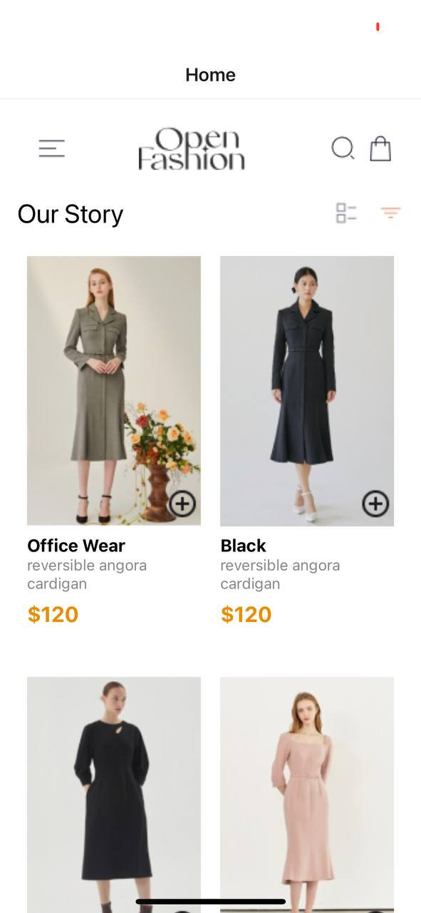
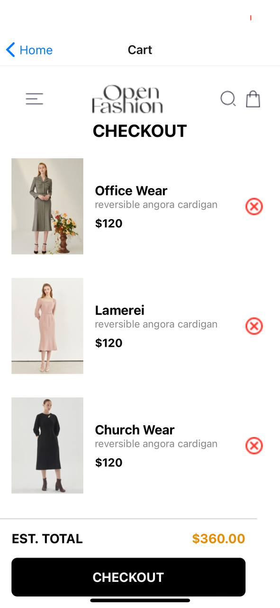

Student ID: 11286009 

## Overview
This mobile application is designed to provide a seamless user experience with a focus on aesthetics and functionality. The app includes a Home screen and Cart Screen. It also supports the use of Local Storage (AsyncStorage, SecureStore, or FileSystem) to store selected items 
locally on the device 

## Features
* Home Screen: Displays the list of available products to the user 
* Carts Screen: Displays selected products to the user while calculating the price of the total items 
* Add to cart to button: Enables the user add the products to the cart
* Remove from Cart button: Enables the user to remove products from cart 

Technologies Used
* React Native: For building the mobile application.
* React Navigation: For handling navigation within the app.
* Styled Components: For styling the application to match the provided UI design.
*Local Storage: Store Items locally on device 
* Custom Components: Created reusable custom components to maintain consistency and reusability across the app.

## Development Process
* Setup: Started with setting up the React Native environment and initializing the project.
* Navigation: Implemented React Navigation for managing screen transitions.
* UI Design: Styled the application using Styled Components to match the provided UI mockup.
* Custom Components: Created reusable custom components for headers, buttons, and other UI elements.
* Testing: Tested the application on various devices to ensure compatibility and responsiveness.

## Usage
* Navigating the App: Use the navigation to switch between home screeb and cart screen 
* adding items to cart: Use the plus symbol on the home screen on each product to add that item to cart 
* Removing items from cart: Use the "X" symbol by  each added product on the cart screen to remove that product from the cart 

## Screenshot

